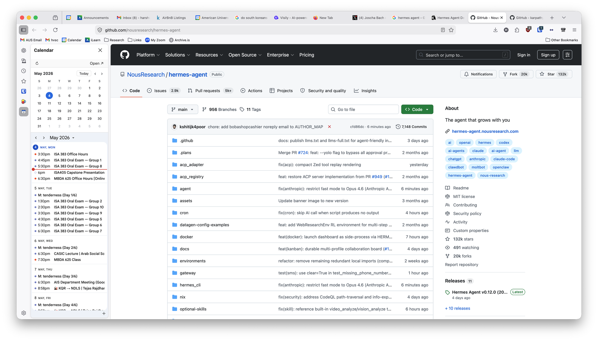

I keep `calendar.google.com` pinned somewhere --- a Cmd+Tab away, a bookmark in the toolbar, a tab I never close. None of those solves the actual problem, which is that I want my calendar *visible*. Not one click away. Not one keystroke away. Just there, on the side, while I work on something else.

Firefox has a real sidebar --- the kind that hosts extension panels alongside the main page; Bitwarden lives there, for example. I built a small extension that puts my Google Calendar in it.

## What It Does

The sidebar has two parts. The top is a plain mini-month calendar: month name, prev/next, today highlighted, click any date to open that day in a new tab. Deliberately no events drawn on the grid; it stays out of the way. The bottom is a compact agenda of my Google Calendar, embedded directly from Google. A reload button, a settings gear, and an "Open in tab" button sit in a thin toolbar on top.

There's a small options page where you set a **Calendar ID** (your Google account email, in the simple case) and an **account index** (`0` for your first logged-in Google account, `1` for the second, etc.). Settings live in `browser.storage.sync`, so they follow the profile across machines. Mine just say `harshvardhan@aus.edu` and `1`, and I forget the page exists.

## Building It

The extension is plain JavaScript --- no framework, no build step, no dependencies. It uses Manifest V2, because Firefox supports it well and the `sidebar_action` API is what makes the whole thing possible.

Three pieces do most of the work. The agenda is Google's `htmlembed` endpoint in an iframe --- that endpoint, unlike most of `calendar.google.com`, is designed to be embedded. A small `webRequest` background script strips `X-Frame-Options` and `Content-Security-Policy` from Google's responses, but only when the request comes from this extension's sidebar; other tabs of `calendar.google.com` are untouched. The mini-month is custom JS, about eighty lines: build a 6×7 grid for the current month, pad with previous/next-month days, highlight today, hook prev/next/Today buttons. A content script also injects `html { zoom: 0.85 }` into the agenda iframe so more events fit at sidebar widths.

The whole thing is around 350 lines of code spread across `manifest.json`, `sidebar.html`, `sidebar.js`, `options.html`, `options.js`, `content.js`, and `background.js`.

## A Caveat About Firefox Extensions

Unsigned extensions in Firefox only persist as "temporary add-ons" --- they vanish on browser restart. To install permanently, you submit the package to Mozilla as an *unlisted* self-distributed extension; their tooling signs it, returns an `.xpi`, and that one installs forever. No public review for the unlisted track, so the round trip takes minutes.

The repo's README has the exact `web-ext sign` command, and a `xpinstall.signatures.required` workaround if you'd rather use Firefox Developer Edition.

You can find the source on [GitHub](https://github.com/harshvardhaniimi/firefox-calendar-sidebar).

This project was orchestrated into existence by [Claude Code](https://claude.ai/code).
