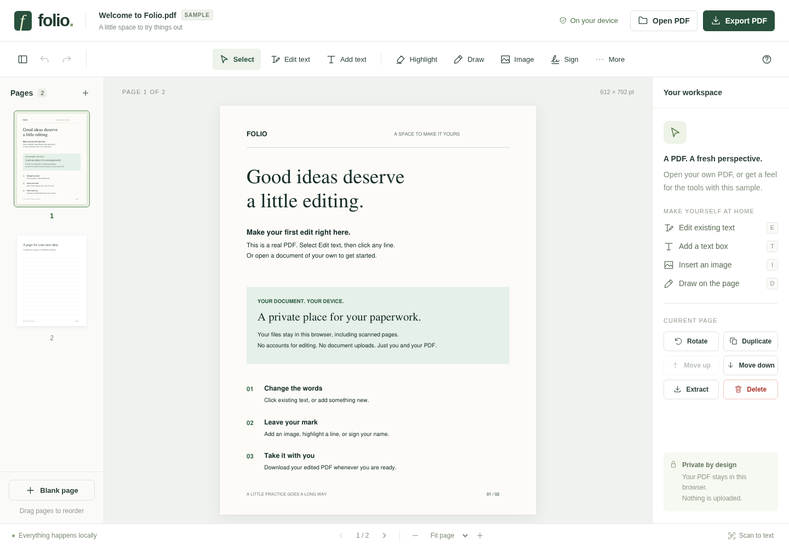
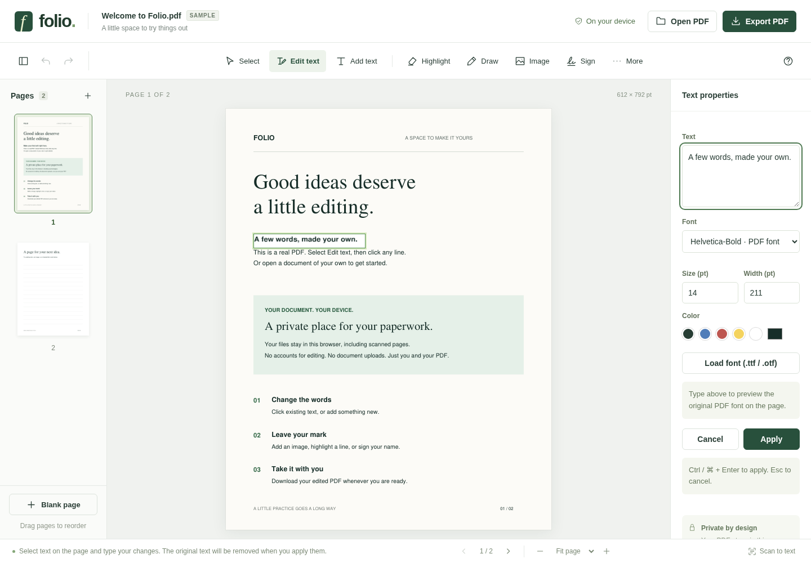
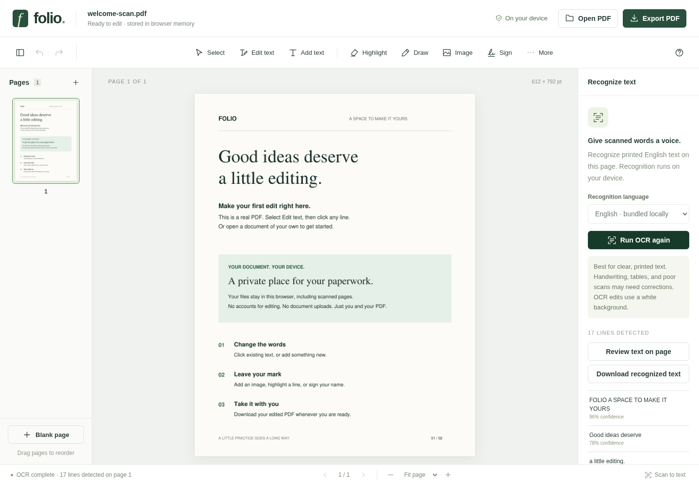

Sometimes a PDF needs one small change: a corrected sentence, an image, or a signature. That should not require uploading the document to someone else's server.

PDF PaperKit is a PDF editor that runs in the browser. Open a file, make your changes on the page, and download the edited copy. The document stays on your device throughout, including when you use OCR. There is no account to create.

[Open PDF PaperKit](https://pdfeditor.harsh17.in/) · [Source code](https://github.com/harshvardhaniimi/pdf-editor)

You can edit existing text, add text boxes and images, highlight passages, draw, sign, and fill standard PDF forms. Pages can be rotated, reordered, duplicated, deleted, or combined with another PDF. Undo and redo are available while the document is open.

Text editing keeps the PDF's font, size, and color where available. Some files contain only a small subset of a font's characters. If an edit needs a missing character, you can load the full font from your device or choose a different one. The page preview shows the font that will appear in the exported PDF.

For scanned PDFs, local OCR recognizes printed English text and lets you review and edit the detected lines. It works best with clear scans. Handwriting and complicated layouts still need care, and a scan cannot tell the editor which font was originally used.

The editor uses MuPDF for PDF processing and Tesseract.js for OCR, both running on your device. Export your work before closing the tab; documents are kept in browser memory and are not automatically saved.
