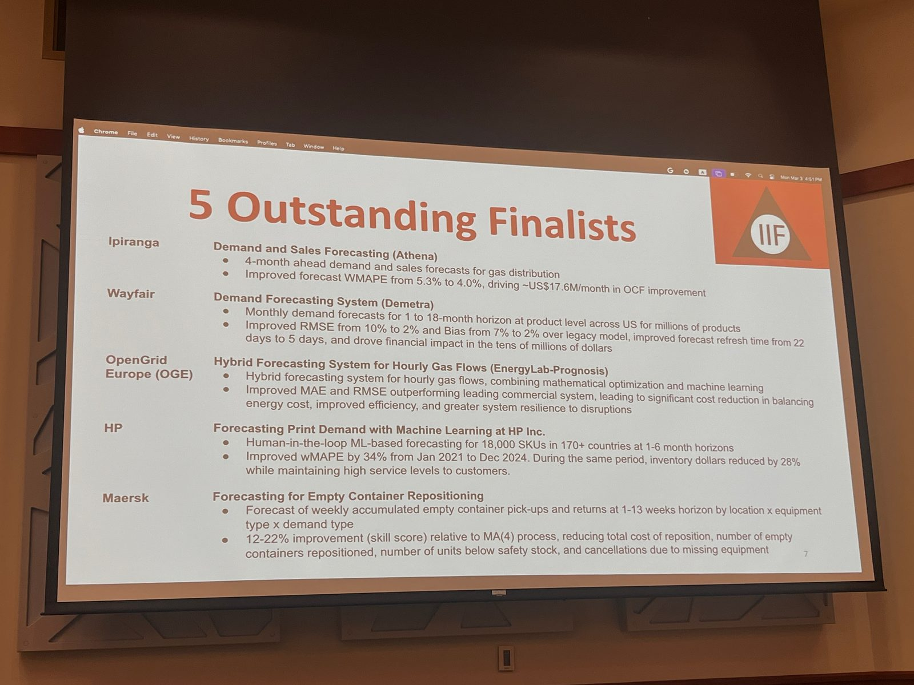

Our work at HP Inc. on enterprise-scale demand forecasting was featured in *Foresight: The International Journal of Applied Forecasting* (Issue 79, 2025).  
I had the privilege of presenting this project at the **International Institute of Forecasting’s Foresight Practitioner Conference**, where HP was named one of five global finalists in the *Forecasting in Practice Competition*.  

*The five outstanding finalists in the IIF Forecasting in Practice competition, with HP among them.*

- [PDF](https://www.harsh17.in/docs/papers/HP_Foresight_Paper.pdf)
- [Conference link](https://forecasters.org/events/foresight-practitioner-conference/)

PDF is shared with permission from the publishers, *International Institute of Forecasters*.
