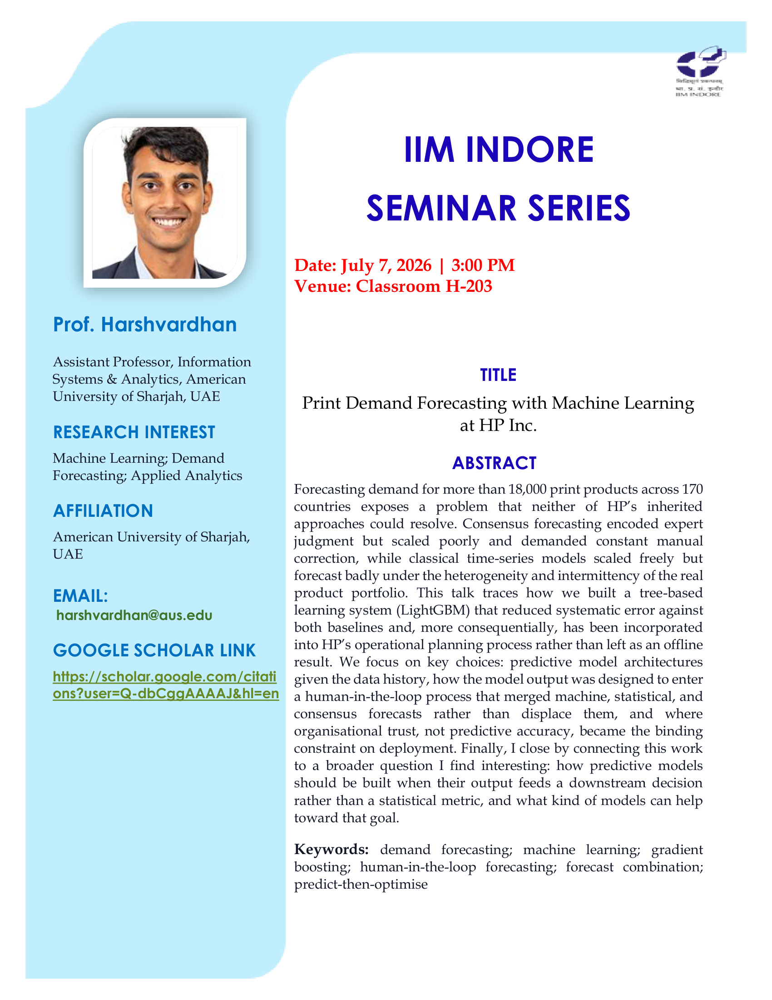

I was invited to give a research seminar in the IIM Indore Seminar Series on our print demand forecasting work at HP Inc., published in the [*INFORMS Journal on Applied Analytics*](/print-demand-forecasting-with-machine-learning-at-hp-inc/) and featured in [*Foresight*](/foresight-paper/).
While I was on campus, I also spoke with IPM students about pursuing research as a career.
This page collects the poster and the slides from the visit.

### The seminar: Print Demand Forecasting with Machine Learning at HP Inc.

Forecasting demand for more than 18,000 print products across over 170 countries exposes a problem that neither of HP's inherited approaches could resolve.
Consensus forecasting encoded expert judgement but scaled poorly and demanded constant manual correction, while classical time-series models scaled freely but forecast badly under the heterogeneity of the real product portfolio.
The seminar traces how we built a tree-based learning system on LightGBM that reduced systematic error against both baselines, and, more consequentially, how it was folded into HP's operational planning through a human-in-the-loop design rather than left as an offline result.
I close on a broader question I find interesting: how predictive models should be built when their output feeds a downstream decision rather than a statistical metric.

- [Slides](/docs/iimi2026/print-demand-forecasting.pdf)
- [Paper — INFORMS Journal on Applied Analytics](/print-demand-forecasting-with-machine-learning-at-hp-inc/)

### A session with IPM students: why pursue research?

While on campus I also spoke to IPM students on why pursuing research as a career option is a good idea.
The talk makes the case for research as a career and then lays out a concrete roadmap: the honest trade-offs of a PhD, the application timeline of tests, recommendation letters, CV, and statement of purpose, how to build a profile through research projects rather than internships, and how to decide where to apply.

- [Slides](/docs/iimi2026/why-a-phd.pdf)
