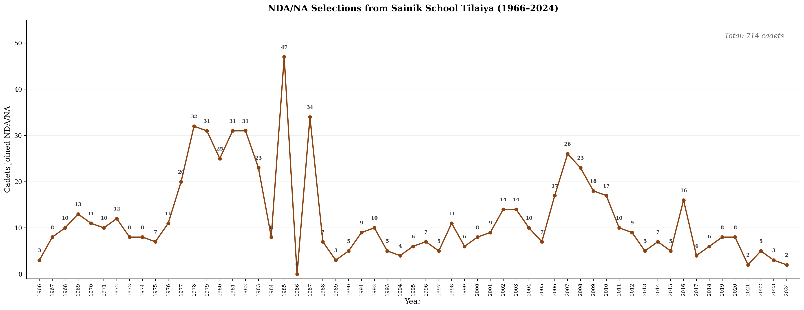
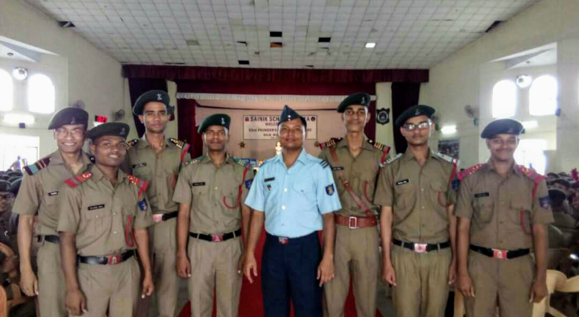
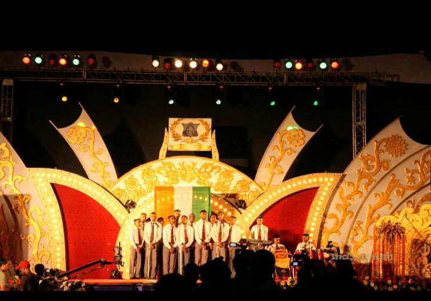
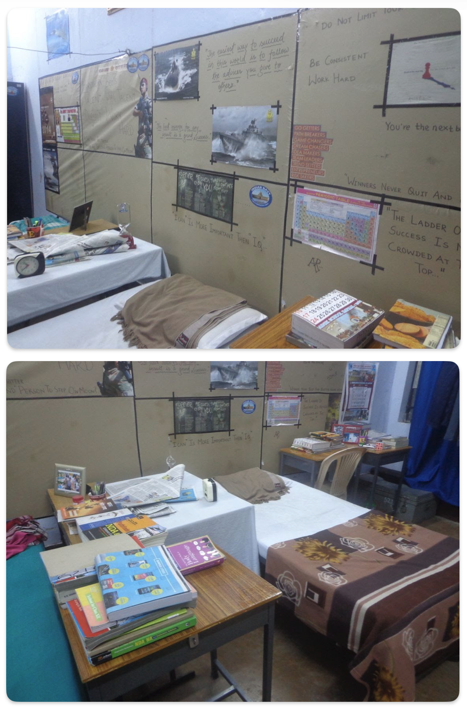
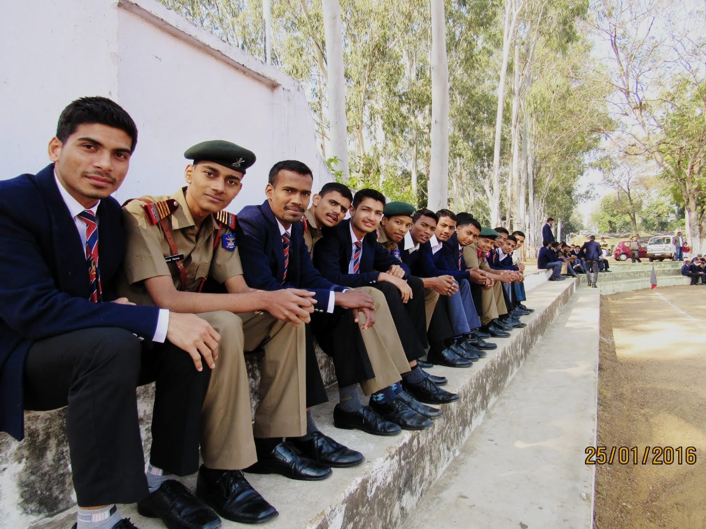
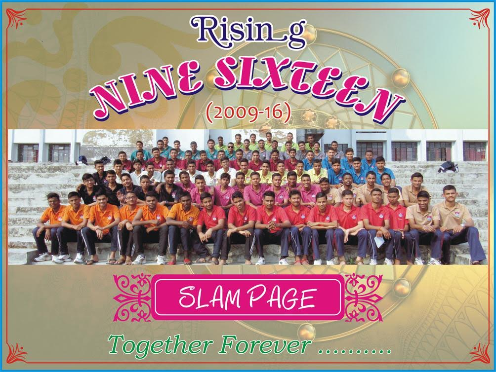

Sainik School Tilaiya made me who I am today. I joined Team Tilaiyans when I passed the National Entrance Exam in 2009 in Class 6. Followed by the written test, we had an interview with the Headmaster, Principal, and Registrar — all posted from officers in the Indian armed forces. I remember that they asked me about IPL and if I knew which teams would be playing tonight. I said I enjoy playing sports rather than watching them. That was followed by a pretty invasive military health test. One common reason people failed medical tests is knocking knees — that when you stand, your knees are touching each other. Apparently, that's bad for your ability to run.

Anyway, I was assigned *Vikram House* in a process akin to the sorting hat in Harry Potter. The Hostel Superintendents would ask some inane questions and you'd be assigned a house based on your characteristics. For example, *Vikram House* had a tradition of Hockey and Drill. Implicitly, everyone who's part of *Vikram House* has to dedicate at least some attention to hockey. Usually, it is much.

## Class 6: The Honeymoon

Class 6 used to live away from the other classes (Class 7–12). We used to joke that the first year is the honeymoon period of the stay at SST. 
When we started our stay, we completely transformed our dormitory area. We got some swans, ducks and fishes in old broken boats and a garden. We quickly learnt that even if you keep little rabbits in a cage, the jackals/foxes/cats can dig their way in. That rabbit gave birth to 12 children and 6 of them died in a week. But we kids saved a lot of life too! The fishes were having a blast. Indeed, once a few of them died of overeating after we boys returned from our dinner with some chicken and everybody brought some and it became too much overall for them.

## The Manners

One of the first things you were given after you joined in Class 6 was a List of Manners. The list contained norms and recommendations on the Rules of SST. Most were derived from [Officer Like Qualities (OLQs)](https://www.mcrhrdi.gov.in/FC2020/week3/Sri%20PKSHARMA,Retd%20(IFS),Officer%20Like%20Qualities.pdf), a list of 15 axioms upon which the [SSB Board](https://en.wikipedia.org/wiki/Services_Selection_Board) of Indian armed forces judge the candidates who become officers[^3].
Not all were sensible in the manners list. Some were stupid additions that exalted power in the hands of seniors. A few examples of manners:

1. You should always have a clean handkerchief in your left pocket.
2. If a senior asks to see handkerchief (which they often did), you turn around slightly, pull it out saying "excuse me sir" and show it.
3. You should not have handkerchief in PT uniform (Physical Training).
4. That you should walk on the right side of the roads and the seniors (Class 9–12) will walk on the left side.
5. Etc.

## History of Sainik School Tilaiya

Sainik School Tilaiya was established in 1963 after the Indian Army were beat by the Chinese; the [1962 Sino-Indian War](https://en.wikipedia.org/wiki/1962_Sino-Indian_War). It is one of the 33 Sainik Schools in India, which are a system of schools established and managed by the Sainik Schools Society under the Ministry of Defence. The primary aim of these schools is to prepare students for entry into the National Defence Academy (NDA) and Indian Naval Academy (INA).

<figure>
  
  <figcaption>NDA/NA selections from Sainik School Tilaiya, 1966–2024. Source: <a href="https://www.sainikschooltilaiya.org/nda-results/">sainikschooltilaiya.org</a></figcaption>
</figure>

We have a lot of traditions in SST. For example, the school song is "We are the Boys of SST... Soldiers are we going to be... So beware... All those who dare... To hurt our dignity...". 
The school motto is "Forward Ever" (अग्रे सरत सर्वदा).
Class 6 is the period where you get the time to learn all of this.

We had an Honour Code that was introduced by Group Captain A.K. Varshney, our Principal in junior years.

> As a Tilaiyan, I will be truthful, trustworthy,
> honest and forthright under all circumstances.
> I will not lie, cheat, mislead or deceive anyone.
> When I commit a mistake, I shall honestly
> own up of my own free will.

Another favourite of mine was the pledge[^6] that we took every morning in the assembly:

> The safety, honour and welfare of my country come first, always and every time.
> The honour, welfare and comfort of the men I command come next.
> My own ease, comfort and safety come last, always and every time.

From left to right: Sarabjeet, *Nalanda* House Captain; Manoranjan Murmu, School Games Captain[^1]; Mayank Kaushal, School Adjutant; Sudhanshu, School Vice-Captain; Squadron Leader Shamim Akhtar, IAF, Headmaster; Me, School Captain; Ehtesham Izhar, School Academics Captain; Pratik, School Co-curricular Activities Captain[^2].

## Honeymoon Over

We moved to Class 7 in 2010. Honeymoon finished. The first noticeable change was that we stayed longer after the movie finished — in school assemblies post Saturday night movies. These school assemblies were organized by School Captain and other Appointments to inspect if the students are following the *manners*. (Five years later, I would be the School Captain and I stopped the practice.) In Class 6, we often were sent early for the dinner. In Class 7–8, a little later. Class 9–10, last.

## Hockey

I tried to play hockey in Class 7/8. I was not very bright at it. Suraj Jee was the house captain and made us work too hard to win the cup. (We called all seniors with "Jee" when referring to them and calling them "Sir" when talking to them.) There is picture of us Class 8 *Vikram House* where all of us are in yellow jerseies except me. On paper I was, but Suraj Jee had kicked me out because of my bad performance.

I liked playing hockey — dribbling ball around, shooting it around, etc. What I didn't like was the competitive mentality around it. After all, it's just a game. Play.

In Class 9, in a crazy turn of events, I became a member of the Hockey School Team and went to Sainik School Gopalganj. It wasn't because of hockey that I was in the team. Regional Sainik Schools have a competition against each other in sports and cultural activities. We were in the central zone — Tilaiya, Nalanda, Gopalganj, Ambikapur. The flaw in design was that the teams sent from non-home schools were strictly based on the sports teams. Thus, there was a real need to have some inductions of people who could take Sainik School Tilaiya up in the cultural sphere, helping us win the cultural cup. (We did win gold and silver medals in mime and music.) But, I was an assignee in the team. In Class 10, I went to Sainik School Nalanda as a member of the Volleyball team.

## Languages and Grades

When I joined SST, I didn't want to study languages at all. My brother used to tease me on my plea: you can quiz me on any subject, any chapter but not Hindi grammar. Even though Hindi is my mother tongue, I am terrible at its grammar. Now a days, I am trying to revive my interests. My percentage in Class 6 was 69%, with a rank of 19/34 or so. In Class 7, it was 72%; Class 8 — 79%; Class 9 — 87%; Class 10 — 9.6 CGPA (91.2%); Class 11 — 93% (I was 4/93; got Best Academician in the Vikram House); Class 12 — 90.8%.

My score had a jump from Class 8 to Class 9 when Sanskrit dropped. Then another one when Hindi dropped in Class 10 to 11. In Class 11, I was so glad that all questions I studied were real hard topics — not [languages](https://blog.harsh17.in/languages/).

## Music Club

Music Club became a defining part of my life in Class 8 and stayed that way until Class 10/11. Mrinal Chakraborty Sir (M.C. Sir as we called him) was our Art teacher also responsible for the Music Club.
Unlike most other clubs, getting in was based on a test. You had to sing "Sa, Re, Ga, Ma, Pa, Dha, Ni, Sa" ("Do Re Mi Fa Sol La Ti Do") and if you could do it well, you got in.

I learnt how to play the Harmonium from M.C. Sir. I regularly played in the school assembly and other events. Keyboard too. My mates were Pratik, Piyush and Sinku. The first two are officers in the Indian Army now too.

He also taught me humility. Most importantly, he taught me to think wide — his first few classes in Art were spent totally in discussing "What is Art?" — weeks at a time. He was a great mentor and I am grateful to have had him in my life. He took a voluntary retirement in 2015.

I also was a member of the Mime team. It was awesome also because sometimes we could escape hard labour like those that happened before the Golden Jubilee celebrations that happened in 2013 (Class 9). While my friends were busy doing श्रम-दान (voluntary labour) in the school, I was busy rehearsing for the music/mime performance.

The Golden Jubilee was done with a BANG. Our Registrar back then was awesome at planning, execution and had the right connections.
Famous Bollywood director Prakash Jha[^4], who is an alumnus from *Vikram House*, was there.
Along with many, many other dignitaries from the Indian armed forces and government. We had a grand parade, cultural performances, and a grand dinner. It was a blast.

## School Captain

Anyway, near the end in Class 11, somehow it looked like I was going to be the next School Captain. D.N. Pandey Sir and P.K. Jha Sir (my house masters) recommended me; the previous school captain Abhishek Jee also recommended me and when Principal was talking to our batch after the final exam of Class 11, the batch too suggested me.

When I was in Class 6, I was really crazed to see Vikas Jee, the school captain from Vaishali House (2009–10). He was the North Star to me in decorum and discipline — though I have never ever talked to him. So, when I actually got to be a School Captain myself, I was very glad.

However, that excitement quickly wore off. There was just SO MUCH RESPONSIBILITIES. I had no clue what I had signed up for. It was a saying that the School Captain is the student among officers and officer among students. So I started getting sucked into everything. I never went to breakfast in Class 12 because I thought if I would go, someone would come with a new complaint or I would have to check the students to ensure they follow the manners that we had talked before.

One of the responsibilities as School Captain is that now so many random documents require your signature. There are so many documents and orders that you are "Copy To:". Military is very methodical, Sainik School very much so. I used to get at least a notice a day, not all of them were relevant or useful. But I had to be present.

I changed a lot of rules at my time. I tried my best for the students to realise that they are here to become an independent, sharp and patriotic Indians who would contribute to the development of the country through all walks of life. Indeed, that is the mission of Sainik School Tilaiya. I was a little crazy about the Diaries. The School Diary that we got every year, it was my treasure. So much about the school and the decorum and disciplines and time tables were all published there.

I never fell sick in Class 12. I didn't know what would have happened. Of course, it would have been fine. Sudhanshu was the School Vice-Captain and he was good at organising things — he acted as Understudy many times before.

## Indian Air Force: UPSC (NDA) + SSB + PABT

When my dream to join the Indian Air Force (IAF) was crushed in January 2016 when I failed the PABT (Pilot Aptitude Battery Test)[^5], I was really sad. You can only give PABT once in your lifetime. If you pass it, you are eligible to be a pilot in the armed forces. If not, you can't be a pilot — ever. My dream of seven years to fly a Sukhoi upside down was crushed.
Headmaster Sqn. Ldr. Shamim Akhtar sir gave me a little printout of a quote which I pasted in my room: it essentially said god has other plans.

There came several more opportunities for SSB through technical entries, but I never went. I had joined IIM Indore in 2016 — where I got my B.A. and M.B.A. — and it was not like if I joined the Navy or Army or even the Air Force I could be a pilot. I could be a technical officer, but that was not what I wanted. I wanted to fly planes. So, I never went for SSB again.

---

क्या कहूँ, सैनिक स्कूल में जो पल बीतें है वो यादगार हैं, हर परिपक्ष्य में।

---

[^1]: Currently a Captain in the Indian Army.
[^2]: Also currently a Captain in the Indian Army.
[^3]: The Services Selection Board (SSB) is a five-day interview process used to select officers for the Indian Armed Forces. OLQs — qualities like initiative, courage, stamina, and sense of responsibility — form the framework against which candidates are evaluated.
[^4]: Known for films like *Gangaajal*, *Raajneeti*, and *Satyagraha*. His movies explore themes of social justice, political corruption, and human rights. He is also a recipient of the Padma Shri, one of India's highest civilian awards, for his contributions to the arts.
[^5]: PABT is essentially a hand-eye coordination test. You attend classes on how to read an altimeter, a heading indicator, and other basic instruments, and then you're put in a simple simulator. That's it — a video game that decides whether you can ever be a military pilot. I failed it.
[^6]: This is also the Chetwode Motto, from the Indian Military Academy in Dehradun. It is inscribed on the entrance of the academy and recited across military institutions in India.

