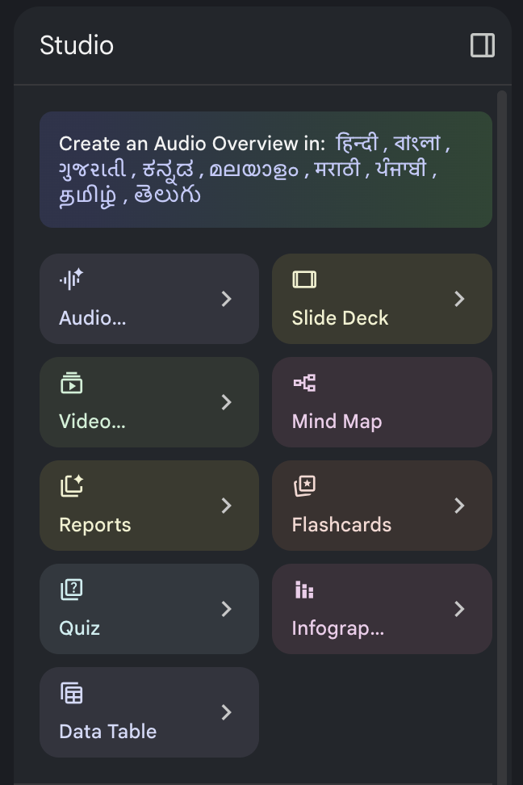
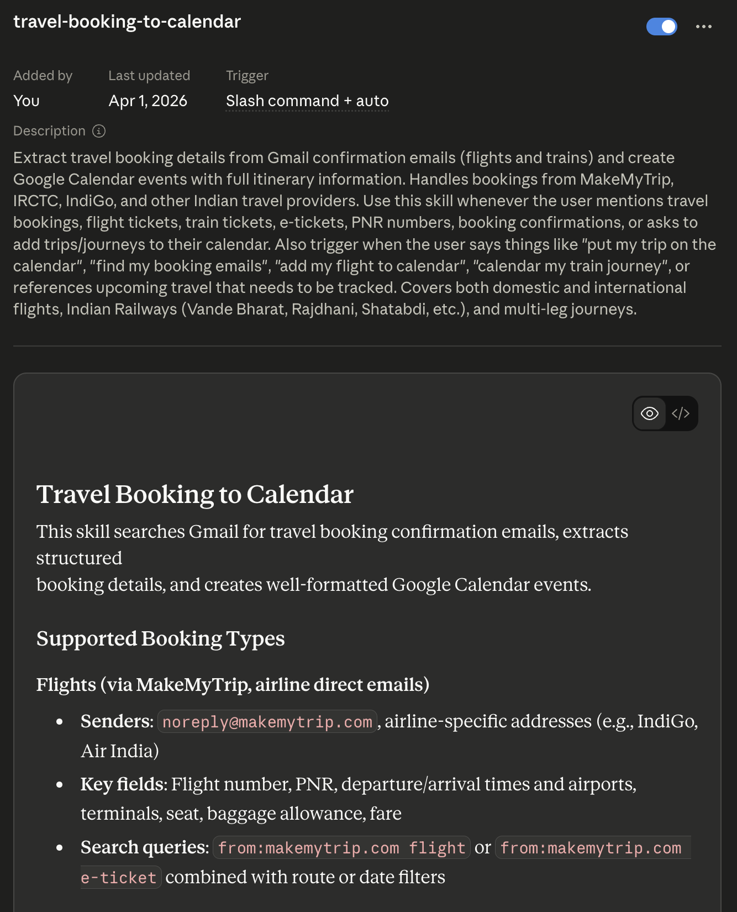

If I have to look back at it, if ChatGPT was the moment when the general public realised what generative models could do — Claude Code was the moment when I realised what generative models could do. Having access to my local machine, giving the model a way to verify what it creates, and being able to do it all remotely — I couldn't have imagined a few years ago that we would have such a technology, and that we would take it so lightly.

This is where Anthropic won over OpenAI. While OpenAI was tuning personalities so that people would find the chatbot more personal, Anthropic was trying to solve hard math and programming problems. There is something Anthropic does at the pre-training stage that makes its models so steadfast at solving problems.

Claude also has better integration with my Gmail, Google Calendar, and Google Drive than Gemini. And Gemini's half-baked features are such a big turnoff. NotebookLM is amazing though. I'm not a big user, but I've always found it useful to be able to summarise so many things — PDFs, videos, audio, websites — in whatever format I like. It can present it as a slide deck (with some of the best infographics), a podcast, a quiz, and more.



But the model has its own quirks. If you leave it talking to itself for long enough, it always ends up discussing [Buddhism](https://harsh17.in/theory-of-mind/). It was even [caught](https://www.reddit.com/r/singularity/comments/1hhz1hb/claude_was_caught_taking_the_bodhisattva_vow_a/) taking the Bodhisattva Vow (a vow to help all beings) on 116 independent occasions. Its general tone is very paternalistic. Always trying to help the other person improve.

Anyway, back to Claude Code (CC).

What Anthropic realised was that it's not the LLMs themselves that matter so much, but the information they have access to. The more information a model has about the task, the better its performance will be. That is how CC beat the copy-paste-from-chatbot workflow most of us had been using with LLMs.

It added things like Skills and MCPs, which allow easy information flow into the app. MCPs are glorified APIs that are designed to work with LLMs; if an API exists, it is generally not hard to create an MCP. Skills, on the other hand, are such a useful idea that I have no clue why ChatGPT and Gemini don't do it already.

LLMs have difficulty remembering a person's preferences for how things should be done — how to access that one specific website's API, or format a document a certain way, or add all your [travel plans](travel-booking-to-calendar.skill) to your calendar with the full details.



So, why not just load those files right before the task needs them? It's like doing a quick revision before the exam. Skills are precisely that. They became so popular that there are [sites](https://claudeskills.info/) where you can find skills too. However, I've found it is much better to create your own skills. Simply ask Claude to identify 3–5 tasks that you ask it to do repeatedly, so that you can make them into Skills. It is pretty good at introspection (*Buddhism?*).

For example, this is Quiz 1 from my ISA 383 (Python for Business Analytics) class last semester, which I wrote and formatted myself in MS Word. And this is what I put together with Claude Code. I still write the questions, but as freeform text in MarkEdit, or I just speak them to Claude Code.[^voice]

<!-- TODO: add screenshot of Quiz 1 — MS Word version as quiz-word.png -->
<!-- TODO: add screenshot of Quiz 1 — Claude Code version as quiz-cc.png -->

There's a night-and-day difference in the formatting of the question paper. Of course, the questions are equally easy (or hard?).

It is able to do that because I gave it the AUS brand guidelines and the logo, which it has saved as a Skill. Every time I hand it the questions and ask it to turn them into a quiz, it writes them down well-formatted, leaves enough space for all answers, leaves space for me to manually write my comments, and includes the points distribution too. Claude actually suggested that I make this into a Skill, since I had already done it three times.

Another great thing about Claude Code, Cowork, and Chat is that they are all pretty integrated. Not neatly, but integrated. You can add Skills and MCPs in Claude Chat and they're available in Claude Code and Cowork.

Speaking of Cowork, some people prefer it over CC — particularly those who don't care about the code Claude executes to do what it does.

It also has fewer permission requests. After a while, the permission requests became annoying to me. Now I have an alias `clawd` which directly opens CC in Terminal with `--dangerously-skip-permissions` and `--effort max`:

```
alias clawd='claude --dangerously-skip-permissions --effort max'
```

When I tell this to people, they often ask: what if it deletes something? Well, it's very easy to fix. You create a folder called `deleted by clwd` and a running `CHANGES.md` which tracks all system changes, so you can revert if something breaks.

Claude Opus 4.7 might not be much smarter than GPT-5.4. However, it's actually the other receptive arms that make Claude the crab that grabs the task at hand. OpenAI realised that and released their Codex app, which was an instant hit.

Claude also added the concepts of agents and sub-agents within CC. For example, say you want to modify several different parts of a complex website. But loading the entire codebase into context memory overcrowds it with low-signal information. So what do you do? You spawn several agents to explore different parts of the codebase and report their findings back to the main agent. Then the main agent drafts the plan of attack (target: solving the problem as it understands it) that you can approve, modify, or reject.

To implement it, it again spawns multiple agents that work on different parts of the codebase. You can even give the agents their own *persona* (not quite the right word, but you get the idea). This only acts as a "suggestion prompt" which the main agent takes into account before writing the actual prompt for the subagent.

Codex now has it too. Codex with GPT-5.4-Thinking (High) is pretty awesome. Its style of working mirrors an experienced senior developer (vs CC as a very smart intern), as [Peter Steinberger](https://steipete.me/) (creator of [OpenClaw](https://openclaw.ai/)) described on the [Lex Fridman Podcast](https://www.youtube.com/watch?v=YFjfBk8HI5o).

OpenAI is generous with usage; Claude is not. Again, Codex could become so much more useful with Skills. In fact, they do have skills — but their implementation is so dicey that I don't even know how to create or use one.

Claude also played it smart in how it connected the model to the user's personal internet through a Chrome extension (vs OpenAI's and Perplexity's full-blown browsers). And Computer Use — which lets it actually control my cursor — has made development so much better. I was able to create [Macchi Trash](https://harsh17.in/macchi-trash/) with absolutely no knowledge of Swift. (It's a pun app. Whenever you move your cursor to the Trash on macOS and there's something in it, flies hover on top. Try it at your own risk.)

So, Anthropic seems to be winning at being more useful. Will OpenAI catch up?

[^voice]: Honestly, ChatGPT's voice-to-text engine rules. Even their open-source model Whisper is the backbone of almost all open-source voice-to-text engines. I often find myself narrating to ChatGPT and then cut-pasting the prompt to Claude.
