It was past nine in the evening, and I was sitting on a tiny plastic stool on a railway track in the middle of Hanoi.
There was a cold beer in my hand.
Then a real train came roaring through, inches from my feet, and everyone calmly pulled their stools back to let it pass.
This was my introduction to Vietnam, and it set the tone for the whole trip.

We were a group of friends, and we travelled the length of the country.
We started in the north, in Hanoi.
Then we flew to Da Nang in the center.
We ended in the south, in Ho Chi Minh City, which everyone still calls Saigon.
Three cities, and each one felt like its own little world.

## Hanoi

In Hanoi, we stayed right next to Hoan Kiem Lake.
A lake in the very center of a busy city is such a lovely idea.
I completely fell in love with it.
You step out of the noise of the traffic, and there is suddenly water, trees, and calm.
Wonderful.
The lake even has a name that comes with a legend, the Lake of the Returned Sword.[^lake]

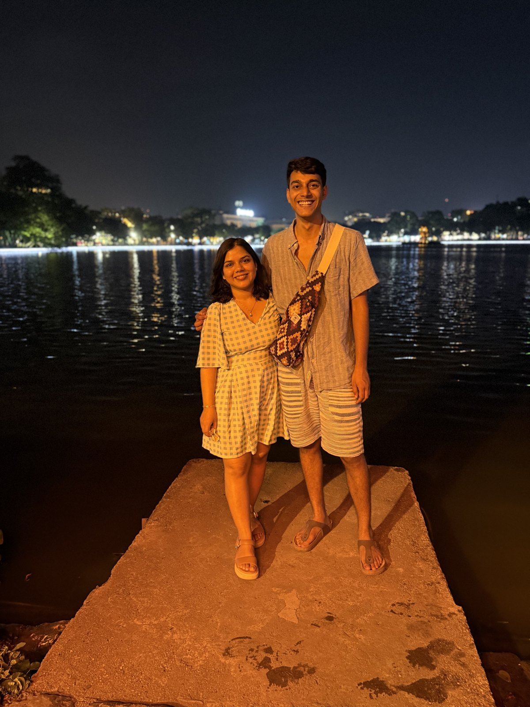

> Hoan Kiem Lake after dark, with the little red Ngoc Son Temple on its island in the middle.

We spent our nights wandering the night markets.
We got some excellent massages.
And the food, the food was wonderful.

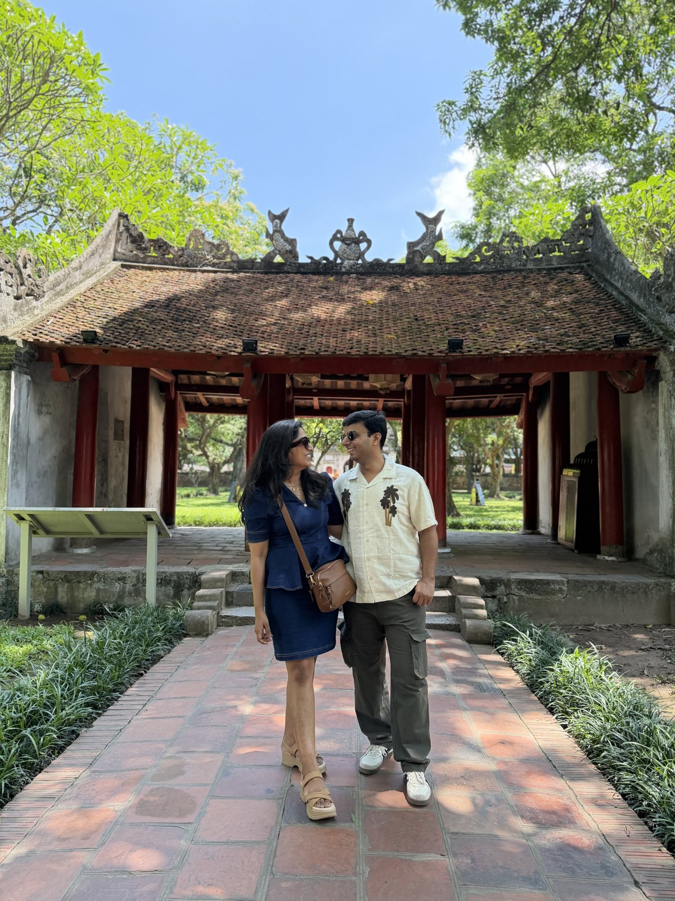

> The Temple of Literature, Vietnam's first university, founded in 1070 and dedicated to Confucius.

One afternoon we went looking for egg coffee.
We had it at the original café, the very one opened by the man who invented the drink decades ago.[^1]
I will be honest, I did not expect to enjoy a coffee made with egg.
But it was delicious, thick and sweet and warm, and I loved every sip.

Then there is Train Street, the famous lane where a working train squeezes past the cafés twice a day.[^railway]
We just sat there with our beers and let the evening pass, and then, on cue, the train came.

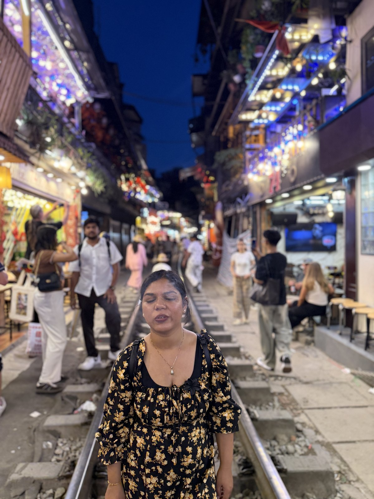

> Train Street at night. The cafés clear their little stools off the rails minutes before each train rolls through.

We also spent an evening on Beer Street, eating local Vietnamese food.
Here is something that surprised me: the food was not spicy at all.
For an Indian palate, it was gentle.
By the time we reached our second city, I had started carrying my own bottle of chili oil.
I am not exaggerating when I say I asked about chili oil at almost every restaurant we visited.

### Halong Bay

From Hanoi, we took a trip out to Halong Bay, and it was magical.
Ha Long means the Bay of the Descending Dragon, and you understand the name the moment you see those thousands of limestone islands rising out of the green water.[^halong]
We bathed in the sea.
We explored caves that felt impossibly old.
Standing inside them, I kept thinking about the largest cave in the world, which also happens to be in Vietnam.[^2]
I did not get to visit it this time.
Some other day.

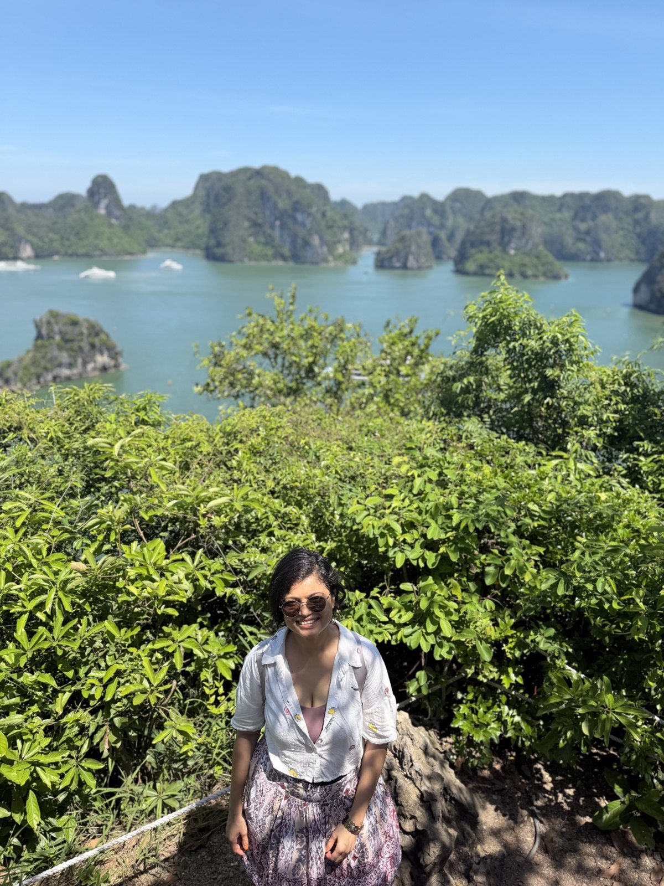

> Halong Bay, thousands of limestone islands rising out of the green water.

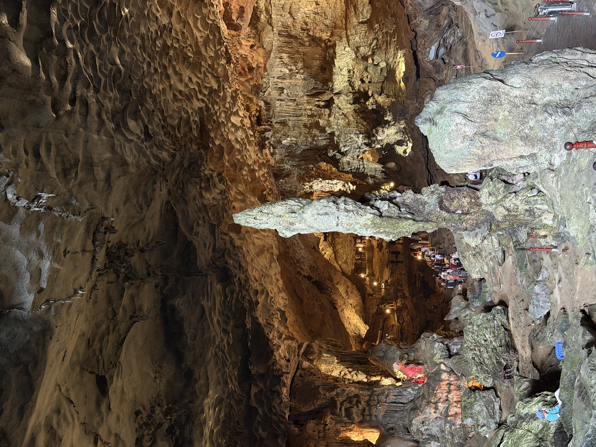

> Inside Sung Sot Cave, the "Surprise Cave", one of the largest in the bay.

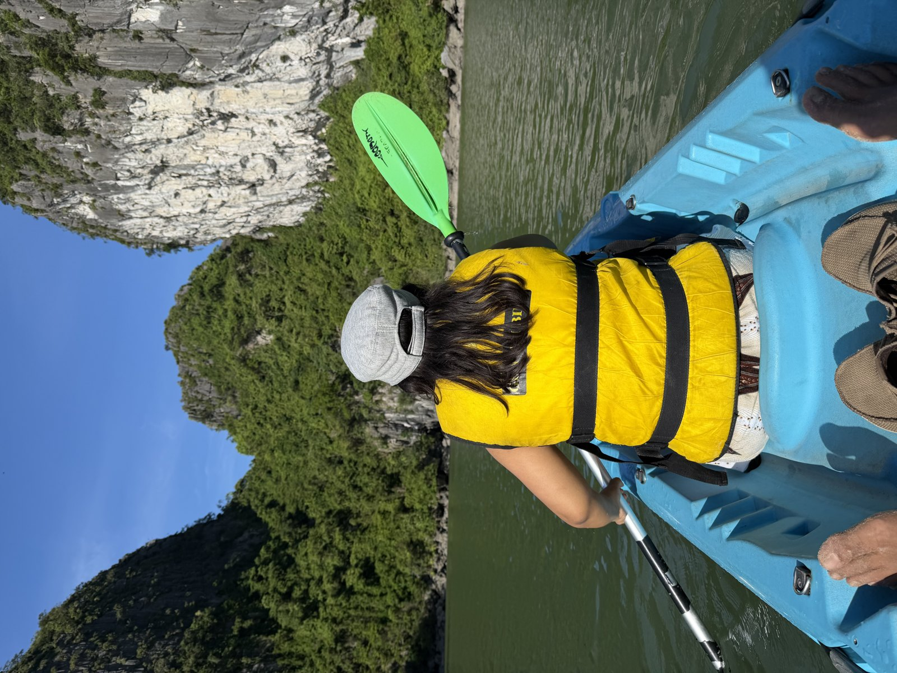

> Kayaking between the karsts.

## Da Nang

Da Nang, in central Vietnam, had a completely different mood.
We went straight to My Khe Beach and swam for hours.[^chinabeach]

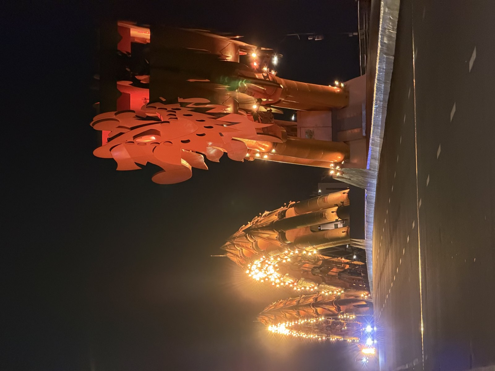

> The Dragon Bridge over the Han River in Da Nang. On weekend nights it breathes real fire and water.

Then we went up to Ba Na Hills.[^bana]
I have never been to a Disneyland or a Universal Studios in my life.
So this was the closest I have ever come to that kind of place, and it amazed me.
It was huge.
I genuinely could not believe how huge it was.
The cable car ride was beautiful, there was the famous golden bridge held up by two giant stone hands, and I had a very good cup of coffee at the top.

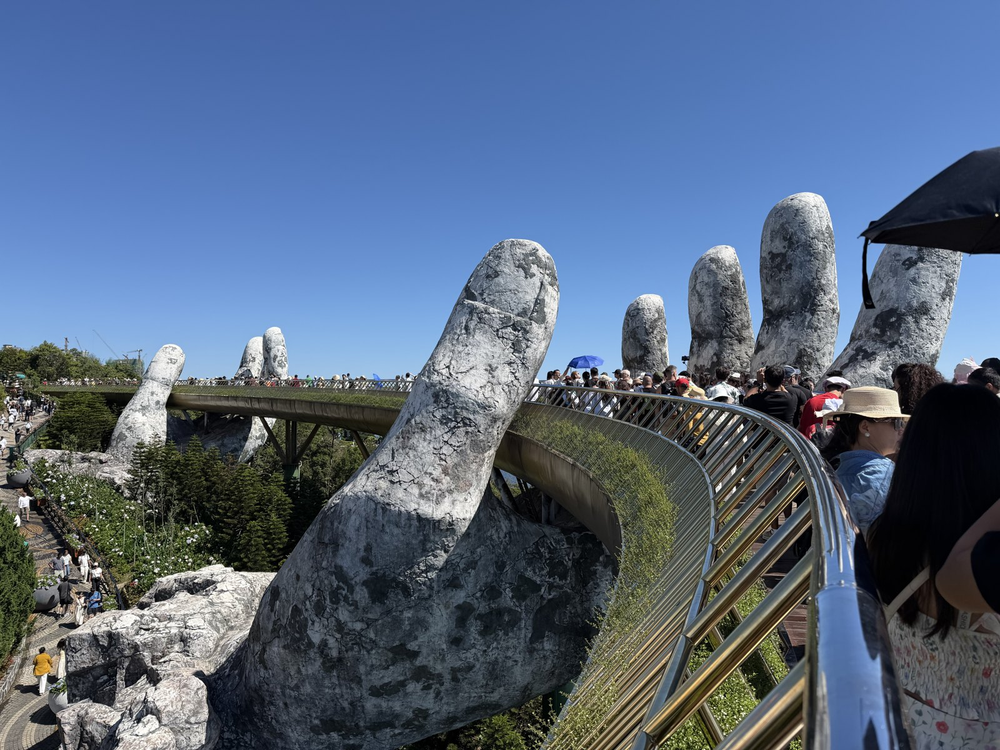

> The Golden Bridge at Ba Na Hills, carried by two giant stone hands.

What surprised me most came later, when I learned that the whole place is built and run by a private company called Sun Group.
That small fact opened something up in my head.
We tend to bundle capitalism, democracy, and the market economy together, as if they are one and the same thing.
America, and through it much of the world, has trained itself to read communism as the state owning everything.
But that does not have to be true.
Vietnam shows it, and so does much of China.
A one party state does not mean the government owns every business.
Private enterprise can still rise, compete, and thrive.[^sungroup]

We found another lovely beach in Da Nang too, and spent a slow day by the water.

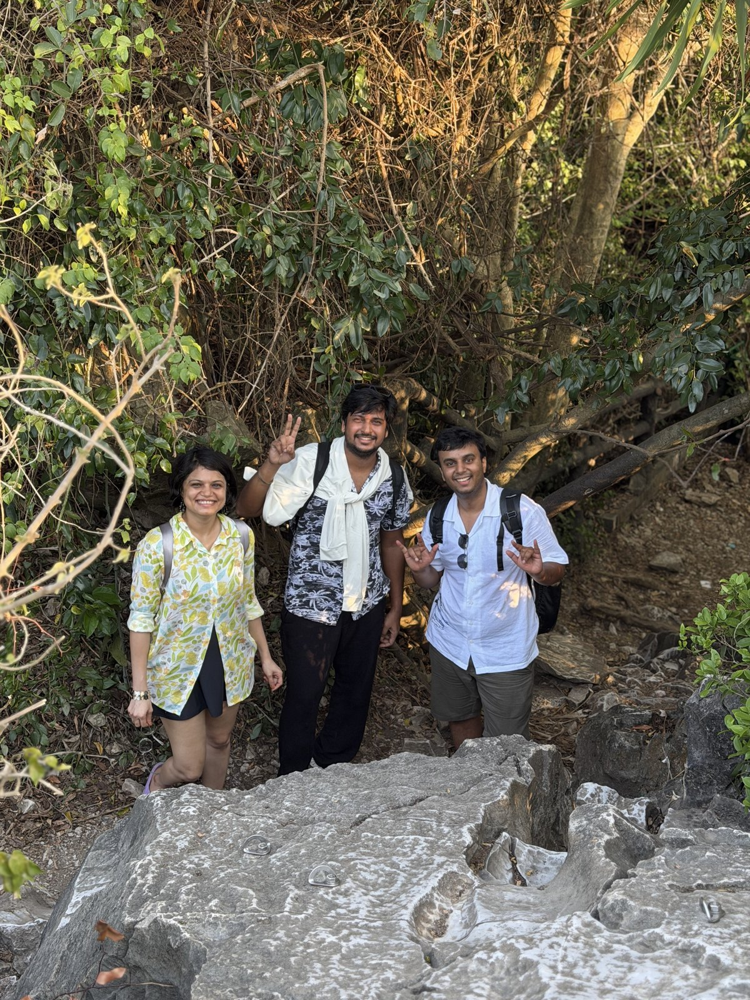

> Climbing the Marble Mountains, a cluster of limestone and marble hills just outside Da Nang.

### Hoi An

A short drive away is Hoi An, an old trading port that has kept its history alive.
For centuries it was one of the busiest harbours in Southeast Asia, where Japanese, Chinese, Indian, and European merchants all met to trade.
At its heart is a beautiful covered bridge built by the town's Japanese community more than four hundred years ago.[^bridge]
But what stayed with me was the older Indian connection.
Long before those traders arrived, this whole region was the heart of the Champa kingdom, Hindu rulers whose civilisation drew deeply from India.[^3]
Their temples were dedicated mostly to Shiva.
That kingdom eventually fell.
Much of what survives of them now sits in a museum nearby, which we sadly did not have the time to visit.
There is also an old temple city close by that tells the same story.

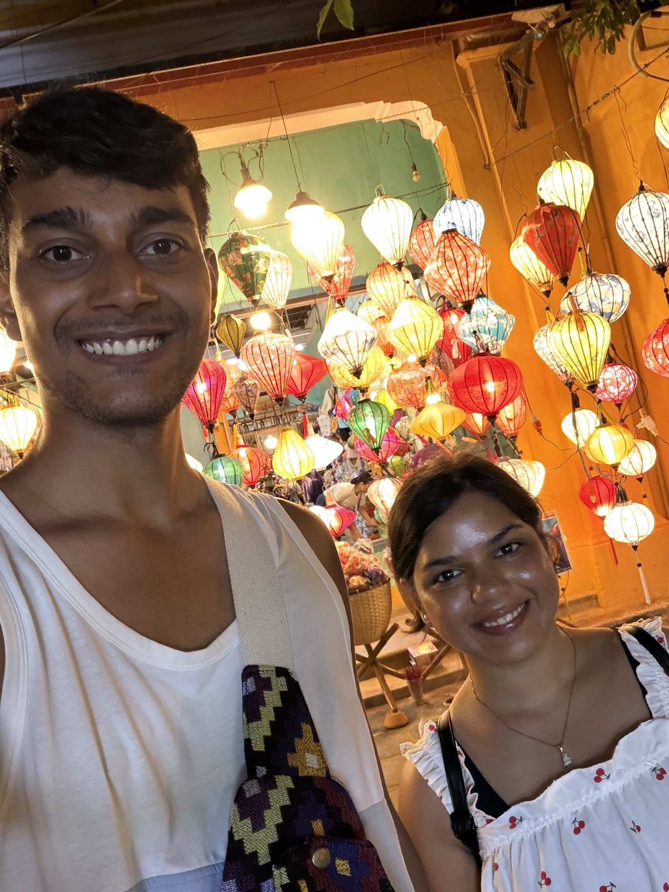

> Hoi An's old town glows with silk lanterns once the sun goes down.

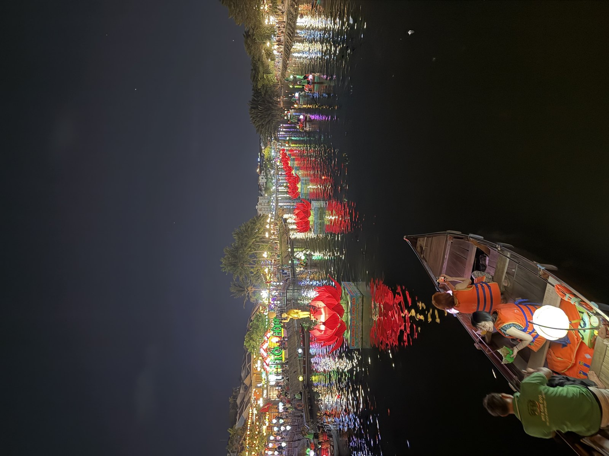

> Boats and floating candle lanterns on the Thu Bon River.

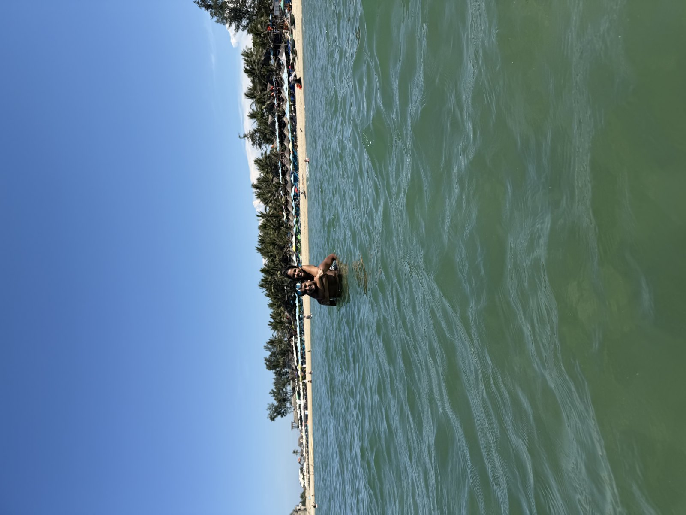

> Long, slow afternoons in the water at the beach near Hoi An.

## North and South

Travelling from Hanoi down to Da Nang taught me something about Vietnam itself.
The north, around Hanoi, has been shaped by Chinese culture for the better part of two thousand years.
The south, around Da Nang and Saigon, carries a deep Indian influence instead.
The more I looked, the more of these threads I found.
One of the early offices of the Indian National Army, led by Netaji Subhas Chandra Bose, was set up in Saigon in a building donated by a Tamil businessman.[^4]

## Ho Chi Minh City

Our last stop was Ho Chi Minh City, or Saigon.
After the lake and the beaches, Saigon felt like a proper big city, fast and tall and busy.
It made for a nice place to rest.
By this point we were all quite tired, and we had happily started waking up late.

Still, Saigon is where the war comes closest.
We visited the Independence Palace, the home and office of the president of South Vietnam.
It has been frozen in time since the morning of 30 April 1975, when a North Vietnamese tank smashed through its gates and the war finally ended.[^palace]
Walking through its quiet war rooms and old rotary phones, you can almost feel that last day.

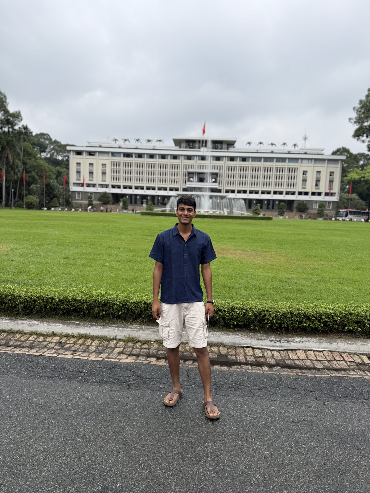

> The Independence Palace, kept exactly as it was on the day Saigon fell in 1975.

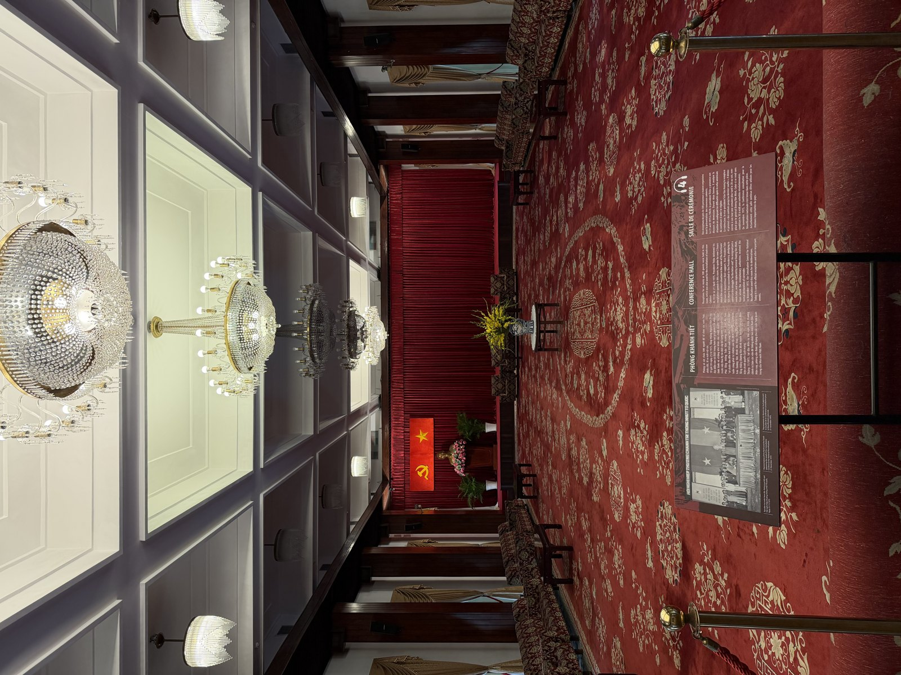

> Inside, the old reception rooms have been left untouched.

Then we went to the War Remnants Museum, and it shook me.
It is gory, and it is real, and it does not look away from anything.
What struck me most was the message.
The museum never tries to simply blame America.
It tries, instead, to say something larger and harder, that war itself is the enemy, and that war is bad.[^warmuseum]
That restraint, in a place that has every reason to be angry, stayed with me for a long time.

After all that weight, we needed something lighter.
In Saigon we visited an immersive Van Gogh museum, where the paintings came alive on every wall around us.
It was strange and lovely to walk straight into a painting and be fully surrounded by it.

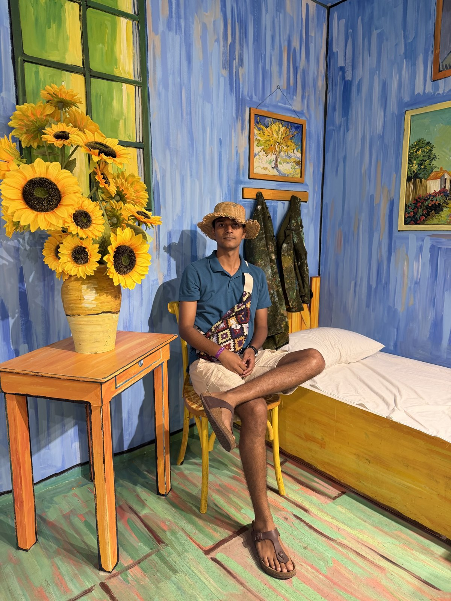

> Sitting inside a recreation of Van Gogh's Bedroom in Arles at the immersive exhibition.

We saw a few other nice corners of the city too.

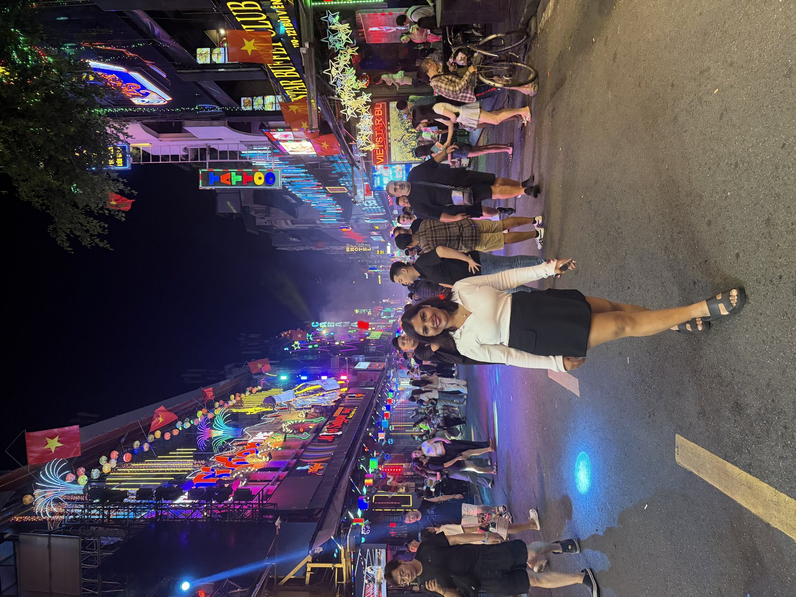

> Bui Vien Walking Street, Saigon's loud, neon-lit nightlife strip.

And then it was over.
We flew home through Kolkata, and from there each of us went our own way.
It was a group trip, and it was so much fun.

## Concluding Remarks

Vietnam gave me three cities and three completely different feelings.
Hanoi was the lake, the lanes, and the egg coffee.
Da Nang was the beach and the hills.
Saigon was the rush of a modern city, and the quiet weight of a war it has not forgotten.
I came back with full memories, a deeper sense of how India and Vietnam are quietly tied together, and a near religious devotion to carrying my own chili oil.

[^1]: Egg coffee, or cà phê trứng, was created in 1946 by Nguyễn Văn Giang, a bartender at the Metropole hotel in Hanoi. Milk was scarce at the time, so he whisked egg yolk with condensed milk to top the coffee instead. He later opened Giảng Café, which his family still runs today.

[^2]: Hang Sơn Đoòng, in Phong Nha-Kẻ Bàng National Park in central Vietnam, is the largest known cave in the world by volume. A local man, Hồ Khanh, stumbled upon it in 1990, and it was properly surveyed only in 2009. It is large enough to hold a city block, with its own jungle and clouds forming inside.

[^3]: The kingdom was Champa, a Hindu civilisation that ruled much of central Vietnam for over a thousand years. Its temple complex at My Son, near Hoi An, is now a UNESCO World Heritage site, and most of its sanctuaries were dedicated to Shiva. Many of the surviving sculptures sit in the Museum of Cham Sculpture in Da Nang.

[^4]: Colonial Saigon had a large and prosperous Indian merchant community, many of them Tamil Chettiars, who funded temples, businesses, and causes across the city.

[^lake]: According to legend, in the fifteenth century the emperor Lê Lợi was given a magic sword by a golden turtle god, and he used it to drive the Chinese Ming army out of Vietnam. After the victory, while he was boating on the lake, the turtle rose again and took the sword back into the depths. The name has meant the Lake of the Returned Sword ever since.

[^railway]: The track is part of the old railway the French built across Indochina in the early twentieth century. Over the years the houses crept so close to the line that the train now passes within an arm's length of people's front doors.

[^halong]: Legend says the gods sent a family of dragons to defend Vietnam from invaders. The dragons spat out jewels and jade that turned into the islands and karst pillars scattered across the water, forming a wall against the enemy ships. Halong Bay is now a UNESCO World Heritage site.

[^chinabeach]: American servicemen during the Vietnam War knew My Khe and the shore beside it as "China Beach", a spot used for rest and recreation. It later lent its name to an American television series.

[^bana]: The French built Ba Na as a hill station in the 1920s to escape the heat, and you can still feel that in the mock European village at the top. The golden bridge, held up by two giant stone hands, is much newer and opened only in 2018.

[^sungroup]: Sun Group is one of Vietnam's largest private conglomerates, founded in 2007, and it built the Ba Na Hills resort, its cable cars, and the golden bridge. Vietnam opened itself to private enterprise and foreign investment through the Đổi Mới reforms of 1986, while keeping its single party political system, much as China did after 1978.

[^bridge]: The Japanese Covered Bridge was built around the end of the sixteenth century to link the Japanese quarter with the Chinese one across a small stream. It is one of very few of its kind anywhere and still stands at the centre of the old town.

[^palace]: The Independence Palace, also called the Reunification Palace, was the seat of the South Vietnamese government. A communist tank crashing through its gates on 30 April 1975 marked the Fall of Saigon and the end of the Vietnam War. The building is preserved almost exactly as it was on that day.

[^warmuseum]: The War Remnants Museum opened soon after the war ended in 1975. It was given its current, more neutral name in 1995, the year Vietnam and the United States restored diplomatic relations.
